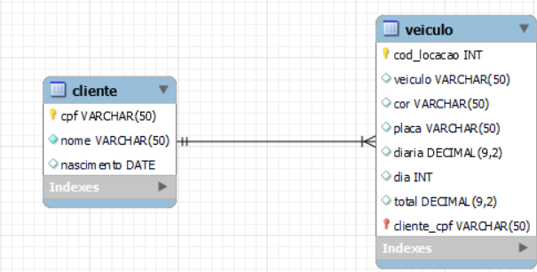

# Sistema de Locação de Veículos

Este é um exemplo de um sistema de locação de veículos implementado em MySQL, com tabelas para armazenar informações sobre veículos, clientes e locações.

## Estrutura do Banco de Dados

### Tabela `cliente`

- `cpf_cliente` (Chave Primária): CPF do cliente, usado como identificador único.
- `nome`: Nome do cliente.
- `nascimento`: Data de nascimento do cliente.

### Tabela `veiculo`

- `cod_locacao` (Chave Primária): Código de locação do veículo, usado como identificador único.
- `veiculo`: Nome do veículo.
- `cor`: Cor do veículo.
- `placa`: Placa do veículo.
- `diaria`: Valor da diária do veículo.
- `cpf_cliente` (Chave Estrangeira): CPF do cliente associado à locação.
- `dia`: Número de dias de locação.
- `total`: Valor total da locação.

### Tabela `veiculos`

- Tabela de apoio que possui informações agregadas sobre locações de veículos.

## Inserção de Dados

- Inserção de registros nas tabelas `cliente` e `veiculo` com dados fictícios para exemplificar o funcionamento do sistema.

## Consulta de Registros

- Verificação dos registros na tabela `veiculo` para garantir que os dados foram inseridos corretamente.

## Criação de View

### View `Todas_locacoes`

- Uma view chamada `Todas_locacoes` é criada para selecionar todas as locações e seus respectivos veículos e clientes. Essa view utiliza a cláusula `JOIN` para combinar informações das tabelas `veiculo` e `cliente` com base no CPF do cliente.

## Consulta da View

- Seleção de registros da view `Todas_locacoes` para obter informações consolidadas sobre locações, veículos e clientes.

